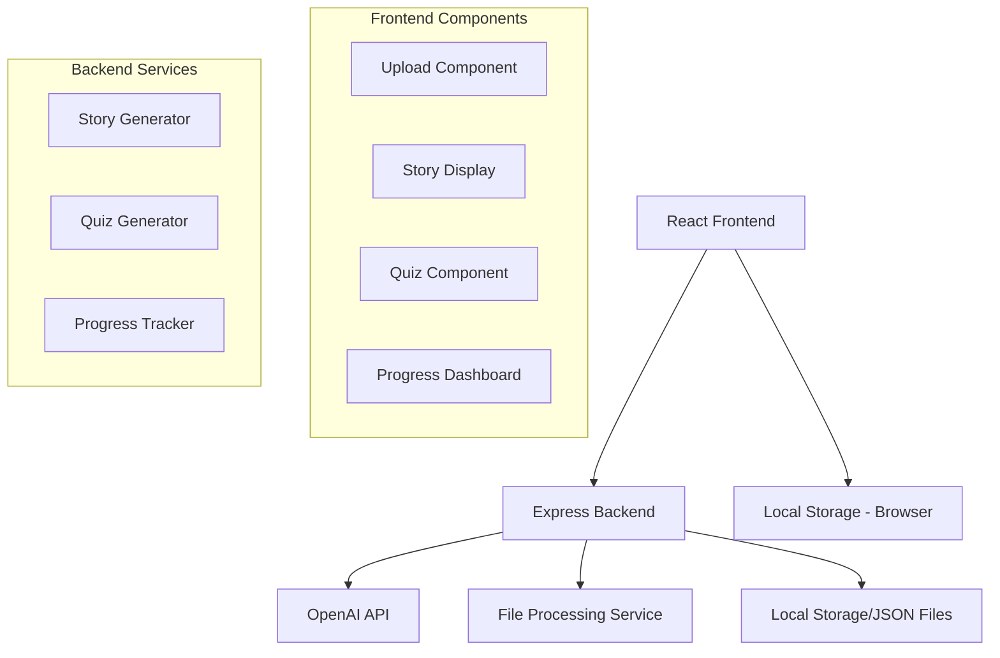

# Spooky Study Buddy - Design Document

## Overview

Spooky Study Buddy is a single-page web application built with React and TypeScript that transforms educational content into engaging Halloween-themed learning experiences. The application uses AI to convert boring study materials into spooky stories and generates interactive quizzes, all wrapped in an immersive Halloween interface.

**Target Users:** Students aged 13-25 who want to make studying more engaging
**Primary Use Case:** Upload study notes → Get spooky story → Take quiz → Track progress
**Technical Approach:** Modern web stack with AI integration for content processing

## Architecture

### System Architecture



### Technology Stack

**Frontend:**
- React 18 with TypeScript
- Tailwind CSS for styling
- Framer Motion for animations
- React Router for navigation
- Axios for API calls

**Backend:**
- Node.js with Express
- TypeScript for type safety
- OpenAI API for content generation
- Multer for file uploads
- CORS for cross-origin requests

**Development Tools:**
- Vite for fast development
- ESLint + Prettier for code quality
- Kiro agent hooks for automation

## Components and Interfaces

### Frontend Components

#### 1. App Layout Component
```typescript
interface AppLayoutProps {
  children: React.ReactNode;
  currentPage: 'upload' | 'story' | 'quiz' | 'progress';
}
```
- Halloween-themed navigation with spooky icons
- Animated background with floating ghosts
- Responsive design for all screen sizes

#### 2. Upload Component
```typescript
interface UploadComponentProps {
  onFileUpload: (content: string, fileName: string) => void;
  isProcessing: boolean;
}
```
- Drag-and-drop file upload area styled as a cauldron
- Support for .txt, .pdf, and direct text input
- Loading animation with bubbling cauldron effect

#### 3. Story Display Component
```typescript
interface StoryDisplayProps {
  story: SpookyStory;
  onStartQuiz: () => void;
  onShare: () => void;
}

interface SpookyStory {
  id: string;
  title: string;
  content: string;
  characters: string[];
  originalTopic: string;
  createdAt: Date;
}
```
- Typewriter effect for story reveal
- Animated Halloween characters
- Share and quiz buttons with hover effects

#### 4. Quiz Component
```typescript
interface QuizComponentProps {
  questions: QuizQuestion[];
  onComplete: (score: number) => void;
}

interface QuizQuestion {
  id: string;
  question: string;
  options: string[];
  correctAnswer: number;
  explanation: string;
  character: 'ghost' | 'vampire' | 'witch' | 'skeleton';
}
```
- Character-hosted questions with animations
- Progress bar styled as a pumpkin vine
- Immediate feedback with spooky sound effects

#### 5. Progress Dashboard
```typescript
interface ProgressDashboardProps {
  userStats: UserProgress;
}

interface UserProgress {
  storiesCreated: number;
  quizzesCompleted: number;
  averageScore: number;
  badges: Badge[];
  streakDays: number;
}
```
- Halloween-themed progress visualization
- Badge collection display
- Learning streak counter

### Backend API Endpoints

#### Story Generation API
```typescript
POST /api/stories/generate
Request: {
  content: string;
  fileName?: string;
}
Response: {
  story: SpookyStory;
  processingTime: number;
}
```

#### Quiz Generation API
```typescript
POST /api/quizzes/generate
Request: {
  storyId: string;
  difficulty: 'easy' | 'medium' | 'hard';
}
Response: {
  questions: QuizQuestion[];
  estimatedTime: number;
}
```

#### Progress Tracking API
```typescript
GET /api/progress/:userId
Response: UserProgress

POST /api/progress/quiz-complete
Request: {
  userId: string;
  quizId: string;
  score: number;
  timeSpent: number;
}
```

## Data Models

### Core Data Structures

```typescript
// Main story entity
interface SpookyStory {
  id: string;
  title: string;
  content: string;
  originalContent: string;
  characters: HalloweenCharacter[];
  keyLearningPoints: string[];
  difficulty: 'beginner' | 'intermediate' | 'advanced';
  estimatedReadTime: number;
  createdAt: Date;
  shareableLink?: string;
}

// Halloween characters that appear in stories
interface HalloweenCharacter {
  name: string;
  type: 'ghost' | 'vampire' | 'witch' | 'skeleton' | 'pumpkin';
  personality: string;
  catchphrase: string;
}

// Quiz data structure
interface Quiz {
  id: string;
  storyId: string;
  questions: QuizQuestion[];
  totalPoints: number;
  timeLimit?: number;
  createdAt: Date;
}

// User progress and gamification
interface UserProgress {
  userId: string;
  level: number;
  experiencePoints: number;
  storiesRead: SpookyStory[];
  quizzesTaken: QuizResult[];
  badges: Badge[];
  currentStreak: number;
  longestStreak: number;
  favoriteCharacter?: string;
}

interface Badge {
  id: string;
  name: string;
  description: string;
  icon: string;
  unlockedAt: Date;
  rarity: 'common' | 'rare' | 'legendary';
}
```

## Error Handling

### Frontend Error Handling
- Network errors: Spooky ghost character explains connection issues
- File upload errors: Witch character provides helpful guidance
- Processing timeouts: Vampire character suggests trying smaller content
- Invalid file formats: Skeleton character lists supported formats

### Backend Error Handling
- AI API failures: Fallback to template-based story generation
- File processing errors: Clear error messages with suggested fixes
- Rate limiting: Queue system with estimated wait times
- Server errors: Graceful degradation with offline mode

### Error Response Format
```typescript
interface ErrorResponse {
  error: true;
  message: string;
  character: HalloweenCharacter;
  suggestedAction: string;
  errorCode: string;
}
```

## Testing Strategy

### Unit Testing
- Component rendering tests for all React components
- API endpoint tests for backend services
- Utility function tests for content processing
- Mock OpenAI API responses for consistent testing

### Integration Testing
- End-to-end user flow: Upload → Story → Quiz → Progress
- File upload and processing pipeline
- API integration with frontend components
- Cross-browser compatibility testing

### User Experience Testing
- Mobile responsiveness across devices
- Loading time optimization
- Accessibility compliance (WCAG 2.1)
- Halloween theme consistency

### Performance Testing
- Story generation speed (target: <30 seconds)
- Quiz loading performance
- Large file upload handling
- Concurrent user simulation

## UI/UX Design Specifications

### Halloween Theme Guidelines

**Color Palette:**
- Primary: Deep Orange (#FF6B35)
- Secondary: Purple (#6B46C1)
- Accent: Bright Green (#10B981)
- Background: Dark Navy (#1F2937)
- Text: Cream White (#FEF7CD)

**Typography:**
- Headers: "Creepster" font for spooky titles
- Body: "Inter" for readability
- Special text: "Griffy" for character dialogue

**Animation Principles:**
- Subtle floating animations for background elements
- Smooth transitions between pages (0.3s ease-in-out)
- Character animations triggered by user interactions
- Loading states with themed spinners

**Responsive Breakpoints:**
- Mobile: 320px - 768px
- Tablet: 768px - 1024px
- Desktop: 1024px+

### Accessibility Features
- High contrast mode toggle
- Keyboard navigation support
- Screen reader compatibility
- Alternative text for all images
- Focus indicators for interactive elements

## Implementation Phases

### Phase 1: Core Infrastructure (Day 1)
- Project setup with Vite + React + TypeScript
- Basic Express server with CORS
- File upload functionality
- Halloween-themed UI foundation

### Phase 2: AI Integration (Day 2)
- OpenAI API integration for story generation
- Content processing pipeline
- Basic story display with theming
- Error handling implementation

### Phase 3: Quiz System (Day 3)
- Quiz generation from story content
- Interactive quiz component with characters
- Score calculation and feedback
- Progress tracking foundation

### Phase 4: Polish & Features (Day 4)
- Advanced animations and transitions
- Social sharing functionality
- Progress dashboard with gamification
- Mobile optimization and testing

### Phase 5: Final Testing & Deployment (Day 5)
- End-to-end testing
- Performance optimization
- Deployment setup
- Demo preparation

## Security Considerations

### Data Privacy
- No user registration required
- Local storage for progress data
- Temporary file processing (auto-delete after 1 hour)
- No sensitive data collection

### API Security
- Rate limiting on story generation endpoints
- File size limits (max 10MB)
- Content filtering for inappropriate material
- CORS configuration for allowed origins

### Content Safety
- OpenAI content filtering enabled
- Educational content validation
- Age-appropriate Halloween themes
- No scary/disturbing content for younger users